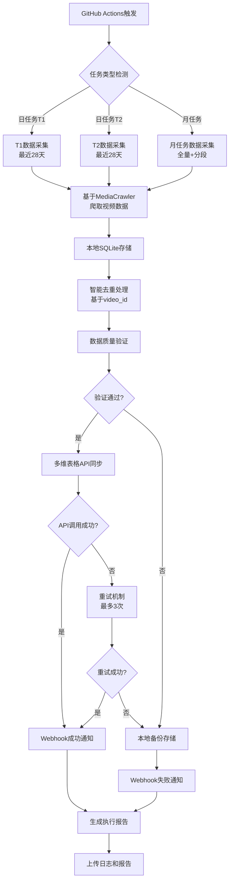
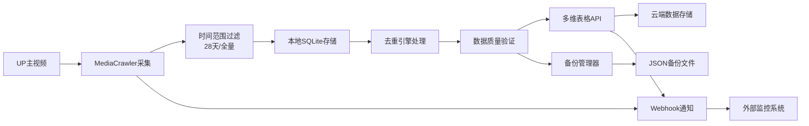

# GitHub Actions执行方案线路图

## 概述

基于你的详细执行方案，本文档提供了B站视频数据跟踪系统的GitHub Actions集成线路图，确保能在一个action任务中执行每日和每月任务。

## 时间安排策略

### 核心时间点设计

```yaml
# 精确时间安排 - 避开UP主周六上午10点上传高峰
schedule:
  # 日任务：T1和T2双时间点采集
  - cron: '0 8 * * *'     # T1: 上午8点 (采集10小时后数据)
  - cron: '0 20 * * *'    # T2: 晚上8点 (采集22小时后数据)
  
  # 月任务：每四周周五执行，避免与日任务重合
  - cron: '0 8 * * 5'     # 每周五8点，实际按周期执行月任务
```

### 时间点说明

| 时间点 | 执行时间 | 目标数据 | 用途 |
|--------|----------|----------|------|
| T1 | 每日8:00 | 前一天10点上传视频的10小时后数据 | 初始互动数据采集 |
| T2 | 每日20:00 | 同一视频的22小时后数据 | 计算12小时增长率 |
| 月任务 | 每周五8:00 | 全量历史数据 + 28天分段 | 历史数据基准建立 |

## GitHub Actions工作流设计

### 主工作流文件

```yaml
# .github/workflows/bilibili-tracking.yml
name: B站视频数据跟踪系统

on:
  schedule:
    - cron: '0 8 * * *'     # 日任务T1
    - cron: '0 20 * * *'    # 日任务T2  
    - cron: '0 8 * * 5'     # 月任务(每周五，按周期执行全量爬取)
  
  workflow_dispatch:
    inputs:
      task_type:
        description: '任务类型'
        required: true
        default: 'daily_t1'
        type: choice
        options:
        - daily_t1
        - daily_t2
        - monthly
      target_creators:
        description: '目标UP主ID列表 (逗号分隔)'
        required: false
        default: ''
      debug_mode:
        description: '调试模式'
        required: false
        default: false
        type: boolean

env:
  PYTHON_VERSION: '3.11'
  TIMEZONE: 'Asia/Shanghai'

jobs:
  determine-task:
    runs-on: ubuntu-latest
    outputs:
      task_type: ${{ steps.task-detection.outputs.task_type }}
      is_monthly_week: ${{ steps.task-detection.outputs.is_monthly_week }}
    
    steps:
    - name: 任务类型检测
      id: task-detection
      run: |
        if [ "${{ github.event_name }}" = "workflow_dispatch" ]; then
          echo "task_type=${{ github.event.inputs.task_type }}" >> $GITHUB_OUTPUT
          echo "is_monthly_week=false" >> $GITHUB_OUTPUT
        else
          # 检查是否为第四周的周五
          current_date=$(date +%Y-%m-%d)
          week_of_month=$(( ($(date -d "$current_date" +%d) - 1) / 7 + 1 ))
          day_of_week=$(date +%u)
          hour=$(date +%H)
          
          if [ "$day_of_week" = "5" ] && [ "$week_of_month" = "4" ]; then
            echo "task_type=monthly" >> $GITHUB_OUTPUT
            echo "is_monthly_week=true" >> $GITHUB_OUTPUT
          elif [ "$hour" = "08" ]; then
            echo "task_type=daily_t1" >> $GITHUB_OUTPUT
            echo "is_monthly_week=false" >> $GITHUB_OUTPUT
          else
            echo "task_type=daily_t2" >> $GITHUB_OUTPUT
            echo "is_monthly_week=false" >> $GITHUB_OUTPUT
          fi
        fi

  bilibili-tracking:
    needs: determine-task
    runs-on: ubuntu-latest
    timeout-minutes: 120
    
    strategy:
      fail-fast: false
      matrix:
        include:
          - task: ${{ needs.determine-task.outputs.task_type }}
    
    steps:
    - name: 检出代码
      uses: actions/checkout@v4
      
    - name: 设置时区
      run: |
        sudo timedatectl set-timezone ${{ env.TIMEZONE }}
        
    - name: 设置Python环境
      uses: actions/setup-python@v4
      with:
        python-version: ${{ env.PYTHON_VERSION }}
        cache: 'pip'
        
    - name: 安装依赖
      run: |
        pip install --upgrade pip
        pip install -r requirements.txt
        
    - name: 验证MediaCrawler集成
      run: |
        python -c "from media_platform.bilibili.core import BilibiliCrawler; print('MediaCrawler集成验证成功')"
        
    - name: 配置系统参数
      env:
        TASK_TYPE: ${{ matrix.task }}
        IS_MONTHLY_WEEK: ${{ needs.determine-task.outputs.is_monthly_week }}
      run: |
        echo "TASK_TYPE=$TASK_TYPE" >> $GITHUB_ENV
        echo "EXECUTION_TIME=$(date -Iseconds)" >> $GITHUB_ENV
        echo "RUN_ID=${{ github.run_id }}" >> $GITHUB_ENV
        
    - name: 执行数据跟踪任务
      env:
        # API配置
        MULTITABLE_API_KEY: ${{ secrets.MULTITABLE_API_KEY }}
        MULTITABLE_BASE_URL: ${{ secrets.MULTITABLE_BASE_URL }}
        
        # Webhook配置
        WEBHOOK_URL: ${{ secrets.WEBHOOK_URL }}
        WEBHOOK_SECRET: ${{ secrets.WEBHOOK_SECRET }}
        
        # B站配置
        BILIBILI_COOKIES: ${{ secrets.BILIBILI_COOKIES }}
        BILI_CREATOR_ID_LIST: ${{ github.event.inputs.target_creators || secrets.DEFAULT_CREATOR_IDS }}
        
        # 系统配置
        DEBUG_MODE: ${{ github.event.inputs.debug_mode || 'false' }}
        MAX_CONCURRENCY_NUM: 5
        CRAWLER_MAX_NOTES_COUNT: 1000
        
      run: |
        python tracking_system/main.py \
          --task-type ${{ env.TASK_TYPE }} \
          --execution-time "${{ env.EXECUTION_TIME }}" \
          --run-id ${{ env.RUN_ID }}
          
    - name: 生成执行报告
      if: always()
      run: |
        python tracking_system/generate_report.py \
          --task-type ${{ env.TASK_TYPE }} \
          --run-id ${{ env.RUN_ID }}
          
    - name: 上传日志和报告
      if: always()
      uses: actions/upload-artifact@v3
      with:
        name: tracking-logs-${{ env.TASK_TYPE }}-${{ github.run_number }}
        path: |
          logs/
          reports/
          data/backup/
        retention-days: 30
        
    - name: 发送完成通知
      if: always()
      env:
        WEBHOOK_URL: ${{ secrets.WEBHOOK_URL }}
        TASK_STATUS: ${{ job.status }}
      run: |
        python tracking_system/send_notification.py \
          --event "task_completed" \
          --task-type ${{ env.TASK_TYPE }} \
          --status ${{ env.TASK_STATUS }} \
          --run-id ${{ env.RUN_ID }}
```

## 项目技术框架

### 核心技术栈

```yaml
技术选型:
  调度系统: GitHub Actions (免费、可靠、易维护)
  数据采集: MediaCrawler + 自定义扩展
  数据存储: SQLite (本地) + 多维表格API (云端)
  通知系统: Webhook + 结构化日志
  编程语言: Python 3.11
  并发控制: asyncio + semaphore
  错误处理: 指数退避重试 + 本地备份
```

### 项目结构

```
bilibili-tracking-system/
├── .github/
│   └── workflows/
│       └── bilibili-tracking.yml          # 主工作流
├── tracking_system/
│   ├── __init__.py
│   ├── main.py                            # 主入口
│   ├── config/
│   │   ├── __init__.py
│   │   ├── settings.py                    # 配置管理
│   │   └── constants.py                   # 常量定义
│   ├── core/
│   │   ├── __init__.py
│   │   ├── crawler_extension.py           # MediaCrawler扩展
│   │   ├── time_controller.py             # 时间范围控制
│   │   ├── deduplication.py               # 去重引擎
│   │   └── data_processor.py              # 数据处理器
│   ├── storage/
│   │   ├── __init__.py
│   │   ├── local_storage.py               # 本地SQLite存储
│   │   ├── multitable_client.py           # 多维表格API客户端
│   │   └── backup_manager.py              # 备份管理
│   ├── notification/
│   │   ├── __init__.py
│   │   ├── webhook_notifier.py            # Webhook通知
│   │   └── report_generator.py            # 报告生成
│   └── utils/
│       ├── __init__.py
│       ├── logger.py                      # 日志工具
│       ├── error_handler.py               # 错误处理
│       └── validators.py                  # 数据验证
├── data/
│   ├── local/                             # 本地数据库
│   ├── backup/                            # 备份文件
│   └── cache/                             # 缓存文件
├── logs/                                  # 日志文件
├── reports/                               # 执行报告
├── requirements.txt                       # Python依赖
└── README.md                              # 项目说明
```

## 执行流程图

### 任务执行流程



### 数据流向图



## 关键实现要点

### 1. 时间范围精确控制

```python
class TimeRangeController:
    def get_task_time_range(self, task_type: str) -> Tuple[str, str]:
        """根据任务类型返回精确的时间范围"""
        now = datetime.now()
        
        if task_type in ['daily_t1', 'daily_t2']:
            # 日任务：最近28天
            end_date = now
            start_date = now - timedelta(days=28)
            
        elif task_type == 'monthly':
            # 月任务：分段处理
            # 前28天作为T1结果，28天之前作为历史数据
            t1_end = now
            t1_start = now - timedelta(days=28)
            monthly_end = t1_start
            monthly_start = now - timedelta(days=180)  # 6个月历史
            
            return (
                (t1_start, t1_end),      # T1数据范围
                (monthly_start, monthly_end)  # 历史数据范围
            )
        
        return (start_date, end_date)
```

### 2. 任务类型智能检测

```python
def detect_task_type() -> str:
    """智能检测当前应执行的任务类型"""
    now = datetime.now()
    
    # 检查是否为第四周的周五
    week_of_month = (now.day - 1) // 7 + 1
    is_friday = now.weekday() == 4
    is_fourth_week = week_of_month == 4
    
    if is_friday and is_fourth_week and now.hour == 8:
        return 'monthly'
    elif now.hour == 8:
        return 'daily_t1'
    elif now.hour == 20:
        return 'daily_t2'
    else:
        raise ValueError(f"Unexpected execution time: {now}")
```

### 3. 去重机制优化

```python
class SmartDeduplicationEngine:
    async def deduplicate_with_time_awareness(self, videos: List[VideoData]) -> DeduplicationResult:
        """时间感知的智能去重"""
        # 按video_id分组
        grouped = self.group_by_video_id(videos)
        
        unique_videos = []
        for video_id, group in grouped.items():
            if len(group) == 1:
                unique_videos.extend(group)
            else:
                # 多条记录：优先级 = 最新时间 > 数据完整性 > 互动数据量
                best_video = max(group, key=lambda v: (
                    v.crawl_time,
                    self.completeness_score(v),
                    v.view_count + v.like_count
                ))
                unique_videos.append(best_video)
        
        return DeduplicationResult(unique_videos=unique_videos)
```

## 监控和告警

### Webhook通知格式

```json
{
  "event": "task_completed",
  "task_type": "daily_t1",
  "status": "success",
  "timestamp": "2024-01-15T08:30:00Z",
  "statistics": {
    "videos_collected": 150,
    "videos_after_dedup": 145,
    "up_masters_updated": 12,
    "api_calls_made": 8,
    "execution_time_seconds": 180
  },
  "errors": [],
  "warnings": [
    "部分视频缺少评论数据"
  ]
}
```

### 错误处理策略

1. **网络错误**: 指数退避重试，最多3次
2. **API限流**: 等待后重试，记录限流时间
3. **数据异常**: 保存到本地备份，继续处理其他数据
4. **系统错误**: 立即停止，发送紧急通知

## 部署和配置

### GitHub Secrets配置

```yaml
必需的Secrets:
  MULTITABLE_API_KEY: 多维表格API密钥
  MULTITABLE_BASE_URL: 多维表格API基础URL
  WEBHOOK_URL: Webhook通知URL
  WEBHOOK_SECRET: Webhook签名密钥
  BILIBILI_COOKIES: B站登录Cookie
  DEFAULT_CREATOR_IDS: 默认UP主ID列表

可选的Secrets:
  SLACK_WEBHOOK_URL: Slack通知URL
  EMAIL_CONFIG: 邮件通知配置
```

### 环境变量配置

```yaml
系统配置:
  MAX_CONCURRENCY_NUM: 5          # 最大并发数
  CRAWLER_MAX_NOTES_COUNT: 1000   # 单次最大爬取数量
  RETRY_MAX_ATTEMPTS: 3           # 最大重试次数
  BACKUP_RETENTION_DAYS: 30       # 备份保留天数
  LOG_LEVEL: INFO                 # 日志级别
```

这个执行方案确保了系统能够在单个GitHub Actions工作流中智能地执行日任务和月任务，同时保持了时间安排的精确性和数据处理的可靠性。