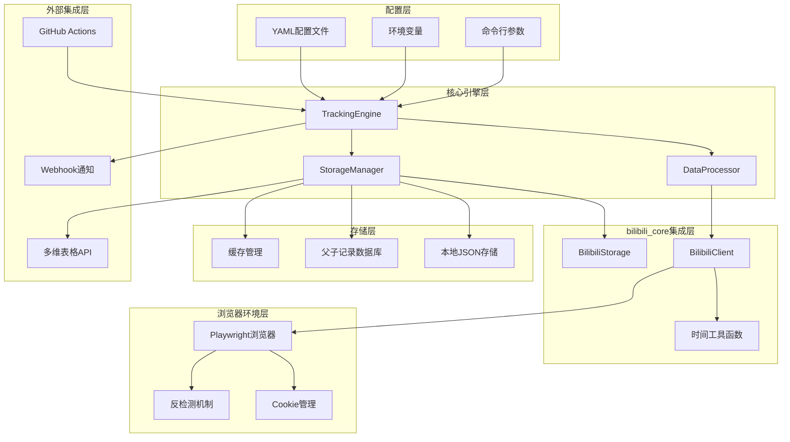

# B站数据采集系统设计文档

## 概述

基于daily_task.py的成功模式和bilibili_core模块的稳定架构，本系统采用模块化设计，构建一个灵活、可扩展的B站视频数据跟踪解决方案。系统核心基于已验证的bilibili_core组件，通过清晰的分层架构实现数据采集、处理、存储和同步功能。

## 核心设计原则

### 1. 基于成功模式的架构设计

参考daily_task.py的成功因素：
- **清晰的职责分离**: 每个类和模块有明确的单一职责
- **直接集成现有组件**: 基于bilibili_core的稳定API
- **健壮的资源管理**: 完善的初始化、执行、清理流程
- **灵活的配置系统**: 支持多环境和多场景配置

### 2. 模块化架构原则

```python
# 核心模块结构
bilibili_tracking_system/
├── core/                    # 核心业务逻辑
│   ├── tracking_engine.py   # 主跟踪引擎 (基于BilibiliDailyTask模式)
│   ├── data_processor.py    # 数据处理器
│   └── storage_manager.py   # 存储管理器
├── config/                  # 配置管理
│   ├── config_loader.py     # 配置加载器
│   └── tracking_config.yaml # 配置文件
├── integrations/            # 外部集成
│   ├── multitable_api.py    # 多维表格API
│   └── webhook_notifier.py  # 通知服务
└── utils/                   # 工具函数
    ├── time_utils.py        # 时间处理工具
    └── data_utils.py        # 数据处理工具
```

### 3. 技术栈选择

#### 核心依赖
1. **bilibili_core模块**: 提供BilibiliClient、BilibiliStorage等核心功能
2. **Playwright**: 浏览器自动化和反检测支持
3. **asyncio**: 异步编程支持高效的并发处理
4. **YAML**: 人性化的配置文件格式

## 系统架构

### 整体架构图



### 核心组件设计

#### 1. TrackingEngine (主跟踪引擎)

基于daily_task.py的BilibiliDailyTask模式设计：

```python
class TrackingEngine:
    """
    主跟踪引擎
    基于daily_task.py的成功模式，提供完整的数据采集流程
    """
    
    def __init__(self, config: TrackingConfig):
        self.config = config
        self.logger = get_logger()
        self.browser_context = None
        self.bili_client = None
        self.data_processor = DataProcessor(config)
        self.storage_manager = StorageManager(config)
    
    async def initialize(self):
        """初始化系统组件"""
        await self._init_browser()
        await self._create_bilibili_client()
        await self._verify_login_status()
    
    async def execute_task(self, task_type: str, target_config: dict):
        """执行跟踪任务"""
        try:
            # 1. 数据采集
            raw_data = await self._collect_data(target_config)
            
            # 2. 数据处理
            processed_data = await self.data_processor.process(raw_data, task_type)
            
            # 3. 数据存储
            await self.storage_manager.store(processed_data, task_type)
            
            # 4. 生成报告
            return await self._generate_report(processed_data)
            
        finally:
            await self.cleanup()
```

#### 2. DataProcessor (数据处理器)

```python
class DataProcessor:
    """
    数据处理器
    负责数据清洗、去重、分析和格式转换
    """
    
    def __init__(self, config: TrackingConfig):
        self.config = config
        self.logger = get_logger()
    
    async def process(self, raw_data: dict, task_type: str) -> dict:
        """处理原始数据"""
        # 1. 数据清洗和验证
        cleaned_data = await self._clean_data(raw_data)
        
        # 2. 父子记录分离
        parent_records, child_records = await self._separate_parent_child(cleaned_data)
        
        # 3. 去重处理
        deduplicated_data = await self._deduplicate(parent_records, child_records)
        
        # 4. 增长率计算 (如果有多时间点数据)
        growth_analysis = await self._calculate_growth_rates(deduplicated_data)
        
        return {
            'parent_records': deduplicated_data['parent_records'],
            'child_records': deduplicated_data['child_records'],
            'growth_analysis': growth_analysis,
            'task_type': task_type,
            'processing_stats': self._get_processing_stats()
        }
    
    async def _separate_parent_child(self, data: dict) -> tuple:
        """分离父子记录"""
        parent_records = []  # 视频基础信息 (静态)
        child_records = []   # 统计数据 (动态)
        
        for video in data.get('videos', []):
            # 父记录: 视频基础信息
            parent_record = {
                'video_id': video.get('bvid'),
                'aid': video.get('aid'),
                'title': video.get('title'),
                'publish_time': video.get('pubdate'),
                'up_id': video.get('owner', {}).get('mid'),
                'up_name': video.get('owner', {}).get('name'),
                'duration': video.get('duration'),
                'description': video.get('desc', ''),
                'cover_url': video.get('pic', ''),
            }
            
            # 子记录: 统计数据
            child_record = {
                'video_id': video.get('bvid'),
                'collection_time': datetime.now().isoformat(),
                'view_count': video.get('stat', {}).get('view', 0),
                'like_count': video.get('stat', {}).get('like', 0),
                'coin_count': video.get('stat', {}).get('coin', 0),
                'favorite_count': video.get('stat', {}).get('favorite', 0),
                'share_count': video.get('stat', {}).get('share', 0),
                'reply_count': video.get('stat', {}).get('reply', 0),
                'danmaku_count': video.get('stat', {}).get('danmaku', 0),
            }
            
            parent_records.append(parent_record)
            child_records.append(child_record)
        
        return parent_records, child_records
```

#### 3. StorageManager (存储管理器)

```python
class StorageManager:
    """
    存储管理器
    支持本地存储、父子记录管理和API同步
    """
    
    def __init__(self, config: TrackingConfig):
        self.config = config
        self.logger = get_logger()
        self.local_storage = self._init_local_storage()
        self.api_client = self._init_api_client() if config.enable_api_sync else None
    
    async def store(self, processed_data: dict, task_type: str):
        """存储处理后的数据"""
        # 1. 本地存储 (优先)
        await self._store_locally(processed_data, task_type)
        
        # 2. API同步 (如果配置且可用)
        if self.api_client and self.config.enable_api_sync:
            try:
                await self._sync_to_api(processed_data, task_type)
            except Exception as e:
                self.logger.warning(f"API同步失败，数据已保存到本地: {e}")
    
    async def _store_locally(self, data: dict, task_type: str):
        """本地存储"""
        timestamp = datetime.now().strftime("%Y%m%d_%H%M%S")
        
        # 存储父记录
        parent_file = f"data/parent_records_{task_type}_{timestamp}.json"
        await self._save_json(parent_file, data['parent_records'])
        
        # 存储子记录
        child_file = f"data/child_records_{task_type}_{timestamp}.json"
        await self._save_json(child_file, data['child_records'])
        
        # 存储分析结果
        if data.get('growth_analysis'):
            analysis_file = f"data/growth_analysis_{task_type}_{timestamp}.json"
            await self._save_json(analysis_file, data['growth_analysis'])
    
    async def _sync_to_api(self, data: dict, task_type: str):
        """同步到多维表格API"""
        # 1. 同步父记录
        await self.api_client.sync_parent_records(data['parent_records'])
        
        # 2. 同步子记录
        await self.api_client.sync_child_records(data['child_records'])
        
        # 3. 更新同步状态
        await self._update_sync_status(data, task_type)
```

#### 4. 配置管理系统

```python
class ConfigLoader:
    """
    配置加载器
    支持YAML配置文件、环境变量和多环境管理
    """
    
    def __init__(self, environment: str = "production"):
        self.environment = environment
        self.config_path = Path("config/tracking_config.yaml")
        self.config = self._load_config()
    
    def _load_config(self) -> dict:
        """加载配置"""
        # 1. 加载基础配置文件
        with open(self.config_path, 'r', encoding='utf-8') as f:
            base_config = yaml.safe_load(f)
        
        # 2. 环境变量覆盖
        env_overrides = self._load_env_overrides()
        
        # 3. 合并配置
        return self._merge_configs(base_config, env_overrides)
    
    def get_target_config(self, target_name: str = "default_target") -> dict:
        """获取目标配置"""
        if target_name == "default_target":
            return self.config.get("default_target", {})
        else:
            return self.config.get("manual_targets", {}).get(target_name, {})
    
    def should_execute_task(self, target_config: dict, task_type: str) -> bool:
        """判断是否应该执行任务"""
        if not target_config.get("up_id"):
            return False
        
        video_scope = target_config.get("video_scope", {})
        
        if task_type in ["daily_t1", "daily_t2"]:
            return video_scope.get("daily_range_days") is not None
        elif task_type == "monthly":
            return video_scope.get("monthly_range_days") is not None
        
        return False

#### 5. 外部集成组件

```python
class MultitableClient:
    """
    多维表格API客户端
    支持父子记录的分别同步
    """
    
    def __init__(self, config: dict):
        self.config = config
        self.api_key = os.getenv(config.get("api_key_secret"))
        self.base_url = os.getenv(config.get("base_url_secret"))
        self.session = aiohttp.ClientSession()
    
    async def sync_parent_records(self, parent_records: List[dict]):
        """同步父记录 (视频基础信息)"""
        table_id = self.config.get("video_master_table_id")
        
        # 批量处理
        batch_size = self.config.get("batch_size", 100)
        for i in range(0, len(parent_records), batch_size):
            batch = parent_records[i:i + batch_size]
            await self._sync_batch(table_id, batch, "parent")
    
    async def sync_child_records(self, child_records: List[dict]):
        """同步子记录 (统计数据)"""
        table_id = self.config.get("video_stats_table_id")
        
        # 按时间分组批量处理
        grouped_records = self._group_by_time(child_records)
        for time_group, records in grouped_records.items():
            await self._sync_batch(table_id, records, "child")
    
    async def _sync_batch(self, table_id: str, records: List[dict], record_type: str):
        """批量同步数据"""
        try:
            # 实现指数退避重试
            for attempt in range(self.config.get("max_retries", 3)):
                try:
                    response = await self._api_request(table_id, records)
                    if response.status == 200:
                        break
                except Exception as e:
                    if attempt == self.config.get("max_retries", 3) - 1:
                        raise
                    await asyncio.sleep(2 ** attempt)  # 指数退避
        except Exception as e:
            # 保存到本地备份
            await self._save_failed_sync(records, record_type, str(e))

class WebhookNotifier:
    """
    Webhook通知服务
    支持任务状态和数据质量通知
    """
    
    def __init__(self, webhook_url: str):
        self.webhook_url = webhook_url
        self.session = aiohttp.ClientSession()
    
    async def notify_task_start(self, task_type: str, target_config: dict):
        """任务开始通知"""
        message = {
            "event": "task_started",
            "task_type": task_type,
            "target": target_config.get("nickname", "Unknown"),
            "timestamp": datetime.now().isoformat()
        }
        await self._send_notification(message)
    
    async def notify_task_complete(self, task_type: str, stats: dict):
        """任务完成通知"""
        message = {
            "event": "task_completed",
            "task_type": task_type,
            "stats": stats,
            "timestamp": datetime.now().isoformat()
        }
        await self._send_notification(message)
    
    async def notify_data_quality_warning(self, warning_type: str, details: dict):
        """数据质量警告通知"""
        message = {
            "event": "data_quality_warning",
            "warning_type": warning_type,
            "details": details,
            "timestamp": datetime.now().isoformat()
        }
        await self._send_notification(message)
```

## 完整的执行流程

### 主程序入口

```python
# main.py
import argparse
import asyncio
from pathlib import Path

from core.tracking_engine import TrackingEngine
from config.config_loader import ConfigLoader
from utils.task_detector import TaskDetector

async def main():
    """主程序入口"""
    parser = argparse.ArgumentParser(description='B站视频数据跟踪系统')
    parser.add_argument('--config', default='config/tracking_config.yaml', help='配置文件路径')
    parser.add_argument('--environment', default='production', help='运行环境')
    parser.add_argument('--task-type', help='任务类型 (auto/daily_t1/daily_t2/monthly)')
    parser.add_argument('--target', default='default_target', help='目标配置')
    parser.add_argument('--dry-run', action='store_true', help='试运行模式')
    
    args = parser.parse_args()
    
    # 1. 加载配置
    config_loader = ConfigLoader(environment=args.environment)
    target_config = config_loader.get_target_config(args.target)
    
    # 2. 检测任务类型
    if args.task_type == 'auto' or not args.task_type:
        task_detector = TaskDetector()
        task_type = task_detector.detect_current_task_type()
    else:
        task_type = args.task_type
    
    # 3. 验证任务是否应该执行
    if not config_loader.should_execute_task(target_config, task_type):
        print(f"任务 {task_type} 被配置跳过或目标配置无效")
        return
    
    # 4. 创建跟踪引擎
    engine = TrackingEngine(config_loader.config)
    
    try:
        # 5. 初始化系统
        await engine.initialize()
        
        # 6. 执行任务
        if args.dry_run:
            result = await engine.dry_run(task_type, target_config)
            print(f"试运行完成: {result}")
        else:
            result = await engine.execute_task(task_type, target_config)
            print(f"任务执行完成: {result}")
            
    except Exception as e:
        print(f"任务执行失败: {e}")
        raise
    finally:
        await engine.cleanup()

if __name__ == "__main__":
    asyncio.run(main())
```

### 任务类型检测

```python
# utils/task_detector.py
from datetime import datetime, time
import calendar

class TaskDetector:
    """任务类型检测器"""
    
    def detect_current_task_type(self) -> str:
        """根据当前时间检测任务类型"""
        now = datetime.now()
        current_time = now.time()
        current_weekday = now.weekday()  # 0=Monday, 4=Friday
        
        # 检查是否是T1时间 (8点)
        if self._is_time_around(current_time, time(8, 0), tolerance_minutes=30):
            # 进一步检查是否是月任务时间 (每四周的周五)
            if current_weekday == 4 and self._is_monthly_task_week(now):
                return "monthly"
            else:
                return "daily_t1"
        
        # 检查是否是T2时间 (20点)
        elif self._is_time_around(current_time, time(20, 0), tolerance_minutes=30):
            return "daily_t2"
        
        # 默认返回T1任务
        else:
            return "daily_t1"
    
    def _is_time_around(self, current: time, target: time, tolerance_minutes: int = 30) -> bool:
        """检查当前时间是否在目标时间的容忍范围内"""
        current_minutes = current.hour * 60 + current.minute
        target_minutes = target.hour * 60 + target.minute
        
        return abs(current_minutes - target_minutes) <= tolerance_minutes
    
    def _is_monthly_task_week(self, current_date: datetime) -> bool:
        """检查是否是月任务执行周 (每四周)"""
        # 简单实现：每月第一个周五
        first_day = current_date.replace(day=1)
        first_friday = first_day + timedelta(days=(4 - first_day.weekday()) % 7)
        
        return current_date.date() == first_friday.date()
```

### 配置文件示例

```yaml
# config/tracking_config.yaml
default_target:
  up_id: "20813884"
  nickname: "老师好我叫何同学"
  
  video_scope:
    daily_range_days: 28
    monthly_range_days: 180
    min_view_count: 1000
    max_videos_per_task: 100
    include_live_videos: false
  
  comments:
    max_comments_per_video: 10
    include_hot_comments_only: true
  
  task_specific_fields:
    daily_task:
      up_fields: ["mid", "name", "fans", "video"]
      video_fields: ["aid", "bvid", "title", "pubdate", "view", "reply", "favorite", "coin", "like", "share"]
      special_fields: ["hot_comments_json", "update_time"]
    
    monthly_task:
      up_fields: ["mid", "name", "fans", "video", "friend", "sign", "level", "official_verify"]
      video_fields: ["aid", "bvid", "title", "desc", "duration", "pubdate", "view", "danmaku", "reply", "favorite", "coin", "like", "share", "tname"]
      special_fields: ["hot_comments_json", "update_time"]

api_config:
  main_table:
    api_key_secret: "MULTITABLE_API_KEY"
    base_url_secret: "MULTITABLE_BASE_URL"
    video_master_table_id: "video_master"
    video_stats_table_id: "video_stats"
    up_masters_table_id: "up_masters"
    batch_size: 100
    max_retries: 3
    enable_parent_child_linking: true

webhook:
  url_secret: "WEBHOOK_URL"
  enabled: true
  events: ["task_completed", "task_failed", "data_quality_warning"]

system:
  max_concurrency: 5
  request_delay: 1.5
  retry_attempts: 3
  timeout_minutes: 90
```

## 部署方案

### 1. 本地开发环境

```bash
# 1. 项目初始化
git clone <your-repo>
cd bilibili-tracking-system

# 2. 环境搭建
python -m venv venv
source venv/bin/activate  # Windows: venv\Scripts\activate

# 3. 安装依赖
pip install -r requirements.txt
playwright install

# 4. 配置文件设置
cp config/tracking_config.yaml.example config/tracking_config.yaml
# 编辑配置文件，设置目标UP主和参数

# 5. 环境变量配置
export BILIBILI_COOKIES="your_cookies_here"
export MULTITABLE_API_KEY="your_api_key"  # 可选
export WEBHOOK_URL="your_webhook_url"     # 可选

# 6. 运行测试
python main.py --task-type daily_t1 --target test --dry-run
```

### 2. GitHub Actions部署 (可选)

```yaml
# .github/workflows/bilibili-tracking.yml
name: B站视频数据跟踪

on:
  schedule:
    - cron: '0 8 * * *'     # T1: 每天8点
    - cron: '0 20 * * *'    # T2: 每天20点
    - cron: '0 8 * * 5'     # 月任务: 每周五8点
  
  workflow_dispatch:
    inputs:
      task_type:
        description: '任务类型'
        required: true
        default: 'auto'
        type: choice
        options: ['auto', 'daily_t1', 'daily_t2', 'monthly']
      target_config:
        description: '目标配置'
        required: true
        default: 'default_target'
        type: choice
        options: ['default_target', 'test', 'full']
      dry_run:
        description: '试运行模式'
        required: false
        default: false
        type: boolean

jobs:
  bilibili-tracking:
    runs-on: ubuntu-latest
    timeout-minutes: 120
    
    steps:
    - name: 检出代码
      uses: actions/checkout@v4
      
    - name: 设置Python环境
      uses: actions/setup-python@v4
      with:
        python-version: '3.11'
        cache: 'pip'
        
    - name: 安装依赖
      run: |
        pip install -r requirements.txt
        playwright install --with-deps
        
    - name: 执行跟踪任务
      env:
        BILIBILI_COOKIES: ${{ secrets.BILIBILI_COOKIES }}
        MULTITABLE_API_KEY: ${{ secrets.MULTITABLE_API_KEY }}
        MULTITABLE_BASE_URL: ${{ secrets.MULTITABLE_BASE_URL }}
        WEBHOOK_URL: ${{ secrets.WEBHOOK_URL }}
      run: |
        python main.py \
          --task-type ${{ github.event.inputs.task_type || 'auto' }} \
          --target ${{ github.event.inputs.target_config || 'default_target' }} \
          ${{ github.event.inputs.dry_run == 'true' && '--dry-run' || '' }}
    
    - name: 上传执行结果
      if: always()
      uses: actions/upload-artifact@v4
      with:
        name: tracking-results-${{ github.run_number }}
        path: |
          data/
          logs/
        retention-days: 30
```

### 3. Docker部署 (可选)

```dockerfile
# Dockerfile
FROM mcr.microsoft.com/playwright/python:v1.40.0-jammy

WORKDIR /app

# 安装Python依赖
COPY requirements.txt .
RUN pip install --no-cache-dir -r requirements.txt

# 复制应用代码
COPY . .

# 创建数据和日志目录
RUN mkdir -p data logs cache

# 设置环境变量
ENV PYTHONPATH=/app
ENV ENVIRONMENT=production

# 健康检查
HEALTHCHECK --interval=30s --timeout=10s --start-period=5s --retries=3 \
  CMD python -c "import sys; sys.exit(0)"

# 默认命令
CMD ["python", "main.py", "--task-type", "auto"]
```

```yaml
# docker-compose.yml
version: '3.8'

services:
  bilibili-tracker:
    build: .
    environment:
      - BILIBILI_COOKIES=${BILIBILI_COOKIES}
      - MULTITABLE_API_KEY=${MULTITABLE_API_KEY}
      - MULTITABLE_BASE_URL=${MULTITABLE_BASE_URL}
      - WEBHOOK_URL=${WEBHOOK_URL}
      - ENVIRONMENT=production
    volumes:
      - ./data:/app/data
      - ./logs:/app/logs
      - ./cache:/app/cache
      - ./config:/app/config
    restart: unless-stopped
    
  # 可选：添加定时任务调度器
  scheduler:
    image: mcuadros/ofelia:latest
    depends_on:
      - bilibili-tracker
    command: daemon --docker
    volumes:
      - /var/run/docker.sock:/var/run/docker.sock:ro
    labels:
      ofelia.job-run.t1-task.schedule: "0 8 * * *"
      ofelia.job-run.t1-task.container: "bilibili-tracker"
      ofelia.job-run.t1-task.command: "python main.py --task-type daily_t1"
      
      ofelia.job-run.t2-task.schedule: "0 20 * * *"
      ofelia.job-run.t2-task.container: "bilibili-tracker"
      ofelia.job-run.t2-task.command: "python main.py --task-type daily_t2"
      
      ofelia.job-run.monthly-task.schedule: "0 8 * * 5"
      ofelia.job-run.monthly-task.container: "bilibili-tracker"
      ofelia.job-run.monthly-task.command: "python main.py --task-type monthly"
```

## 开发阶段

### Phase 1: MediaCrawler集成验证 (1周)

- [ ] 1.1 环境搭建和依赖安装
  - 完整安装MediaCrawler环境
  - 配置Playwright浏览器驱动
  - 验证反检测脚本和停用词文件
  - _Requirements: 基础环境准备_

- [ ] 1.2 BilibiliCrawler集成测试
  - 使用工厂模式创建BilibiliCrawler实例
  - 验证Cookie登录和浏览器上下文
  - 测试WBI签名机制正常工作
  - _Requirements: 核心功能验证_

- [ ] 1.3 数据采集功能验证
  - 测试UP主信息获取
  - 测试视频列表获取
  - 验证MediaCrawler存储机制
  - _Requirements: 数据采集验证_

### Phase 2: 业务逻辑扩展 (2周)

- [ ] 2.1 时间调度系统
  - 实现T1/T2/月任务调度逻辑
  - 集成MediaCrawler的频率控制
  - 添加任务类型检测和执行
  - _Requirements: 调度系统_

- [ ] 2.2 父子记录架构
  - 扩展MediaCrawler存储结构
  - 实现静态信息和动态统计分离
  - 添加数据关联和查询功能
  - _Requirements: 数据架构扩展_

- [ ] 2.3 数据处理和验证
  - 实现数据去重和验证
  - 添加增长率计算逻辑
  - 完善错误处理和恢复
  - _Requirements: 数据质量保证_

### Phase 3: 部署和优化 (1周)

- [ ] 3.1 GitHub Actions集成
  - 配置Playwright在CI环境中运行
  - 实现自动化数据收集工作流
  - 添加结果上传和通知
  - _Requirements: 自动化部署_

- [ ] 3.2 监控和维护
  - 添加运行状态监控
  - 实现错误告警机制
  - 优化性能和资源使用
  - _Requirements: 系统维护_

## 技术优势

### 1. 直接使用成熟方案
- **避免重复造轮子**: MediaCrawler已解决所有B站爬虫技术难题
- **技术风险低**: 使用经过验证的成熟架构
- **维护成本低**: 跟随MediaCrawler更新，无需自维护反爬虫逻辑

### 2. 架构简洁高效
- **无适配层**: 直接使用MediaCrawler API，避免复杂适配
- **功能完整**: 获得完整的反爬虫、频率控制、WBI签名能力
- **扩展性强**: 在稳定基础上添加业务逻辑

### 3. 部署友好
- **Playwright支持**: GitHub Actions原生支持Playwright环境
- **容器化**: 可以轻松打包为Docker镜像
- **云部署**: 支持各种云服务器部署

## 风险评估

### 技术风险
- **MediaCrawler依赖**: 需要跟随上游更新
- **Playwright环境**: 需要浏览器驱动支持
- **资源消耗**: 浏览器环境相对消耗更多资源

### 缓解措施
- **版本锁定**: 锁定稳定版本，定期手动更新
- **环境测试**: 充分测试部署环境兼容性
- **资源优化**: 使用无头模式，优化内存使用

## 总结

这个方案**直接拥抱MediaCrawler的完整架构**，包括Playwright依赖，这是技术上最合理的选择：

1. **技术必然性**: Playwright不是可选依赖，而是架构核心
2. **开发效率**: 避免重复实现复杂的反爬虫逻辑
3. **功能完整性**: 获得MediaCrawler的全部能力
4. **长期维护性**: 跟随成熟项目演进，降低维护成本

通过这种方式，我们可以快速构建一个功能完整、技术先进的B站数据采集系统。